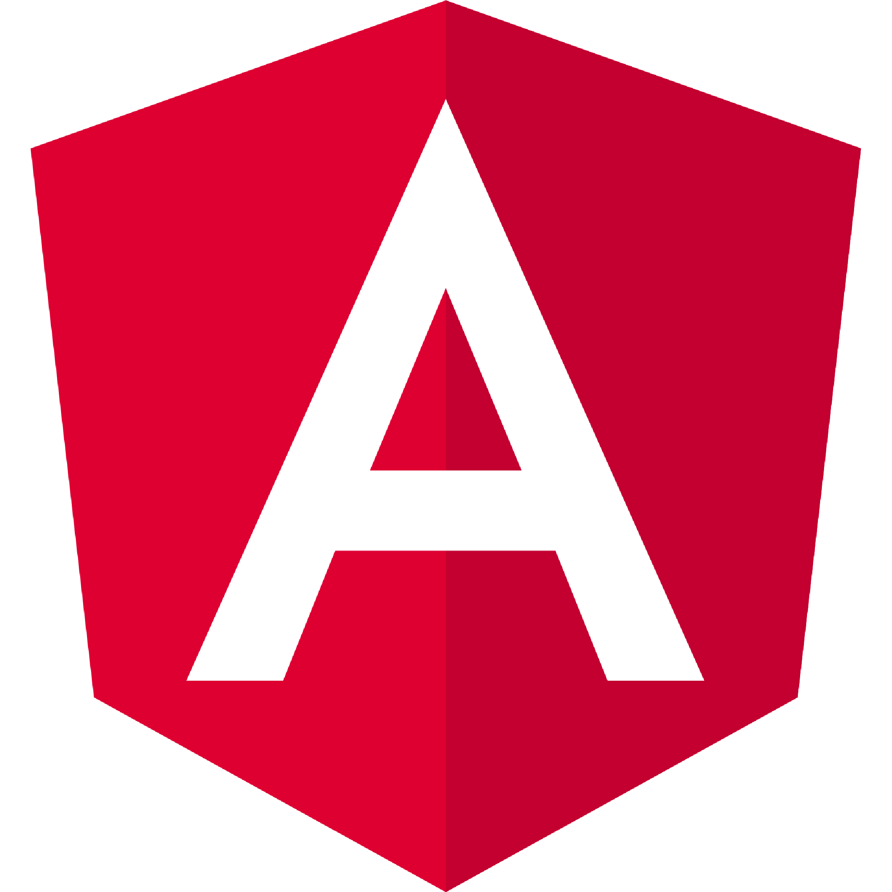

<h1 align="center">Hi 👋, I'm David</h1>
<h3 align="center">A passionate Programmer Developer from Buenos Aires, Argentina.</h3>

- 💻 I’m currently learning in a course of Java that I practice as well POO, JDBC, JEE, Servlets and JSP's with other languages like HTML5, CSS, JavaScript, MySql, Spring and Angular.

- ✉ How to reach me **davidmarquez2222@outlook.com**

<sector>
  <h3 align="left">Connect with me:</h3>
  

  
  

<sector>  
  
<sector>
  <h3 align="left">Languages and Tools:</h3>
  
 
    <code></code>
    <code></code>
    <code></code>
    <code></code>
    <code></code>
    <code></code>
    <code></code>
    <code></code>
  

<sector>

